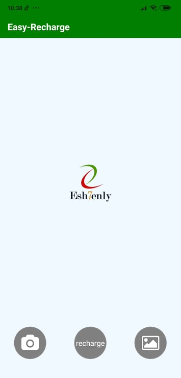
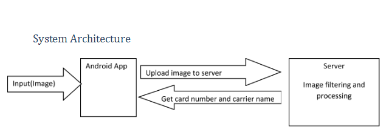
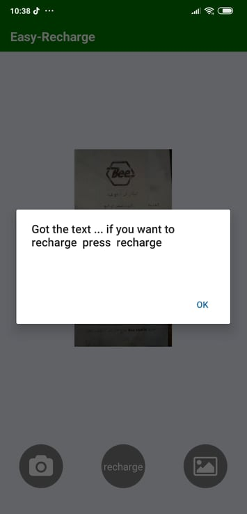
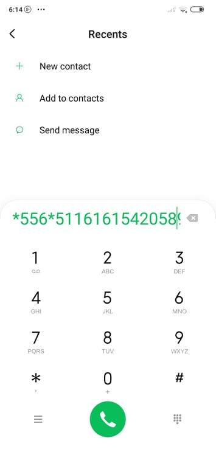
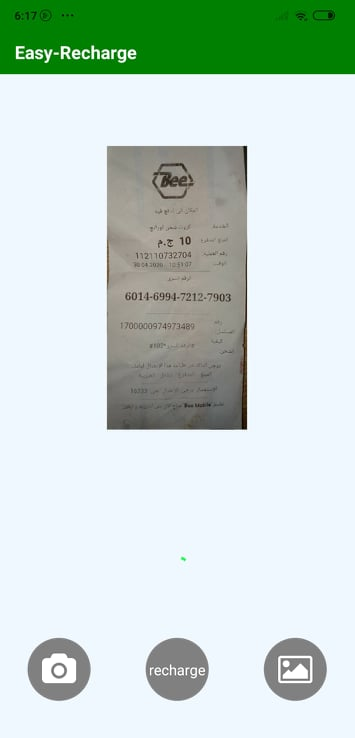
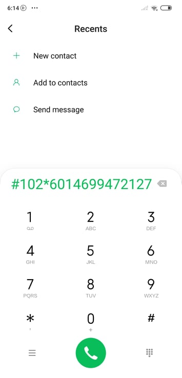

## Easy-Recharge

Easy Recharge is an android application that allow users to take photo of scratch card to recharge it automatically 
there are 2 versions from the application 

1. react application that upload the image to server with python code that uses openCV and tesseract (finished)
2. kotlin application that use firebase library and Ml vision(all steps are done locally) (missing some features)
# commits of all team members appear in branches

# Features 

-Capture from camera or upload image from gallery and recharge automatically 
-Support different types of cards 
-Recharge codes automatically according to the service provider company
-Provide optimized , fast mobile android application
-Share button to share detected serial number (kotlinv ersion)

# System Architecture

# steps 
1. open the application
- 

2. capture an image or upload from gallery
- 

3. detect number from card
- 

4. press recharge button
- 

# test cases
- test case1

1. 
2. 

- test case2
1. 
2. 

