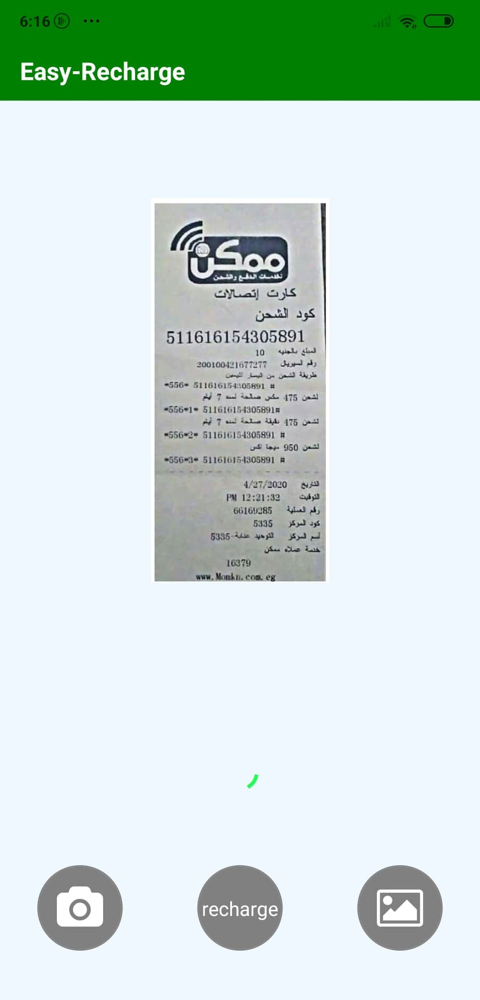

# Project 0

Web Programming with Python and JavaScript

## Easy-Recharge

-Easy Recharge is an android application that allow users to take photo of scratch card to recharge it automatically 
there are 2 versions from the application 
1. react application that upload the image to server with python code that uses openCV and tesseract (finished)
2. kotlin application that use firebase library and Ml vision(all steps are done locally) (missing some features)

#Introduction

-Most of us now use scratch cards or fawry cards to recharge their mobile credit. copying the fifteen digit of the card is annoying to some people.  There is no available application that can do this automatically .Some applications offer taking images for cards but it works for specific kinds of cards not all . For our project, we propose the development of a recharge android  application, in which the user can take a photo of the card using a mobile camera , taking into account various cards providers  like (we ,Etisalat ,orange Vodafone,fawry ,aman ,bee),so in this report we will discuss the steps of developing and implementing this android application
. 

#Features 

-To provide an easy application that acts like a personal assistant.
-Capture from camera or upload image from gallery and recharge automatically 
-Support different types of cards 
-Recharge codes automatically according to the service provider company
-Provide optimized , fast mobile android application
-Share button to share detected serial number

#System Architecture

#steps 
1.open the application

2.capture an image or upload from gallery

3.detect number from card

4.press recharge button

